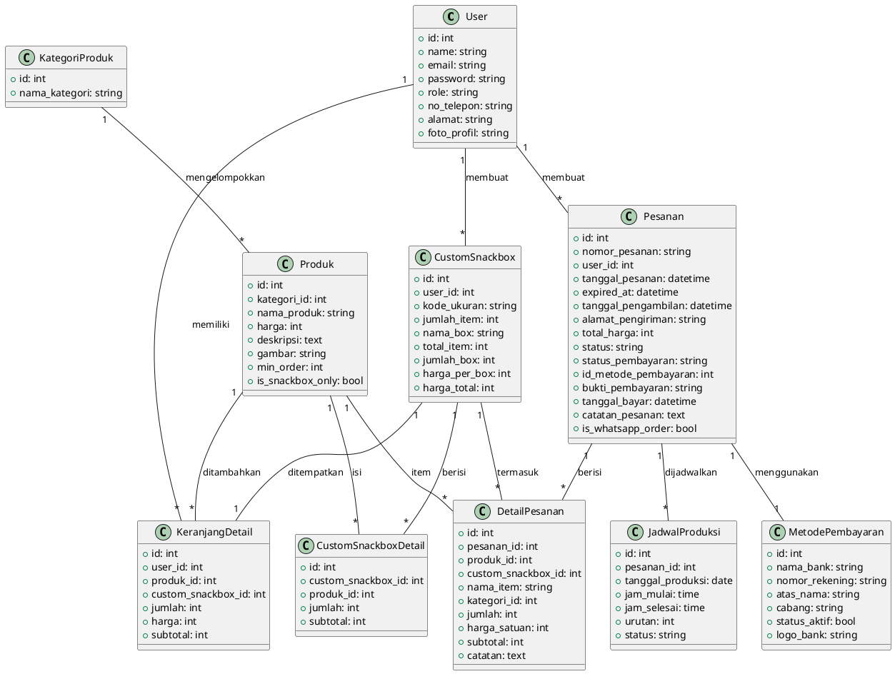
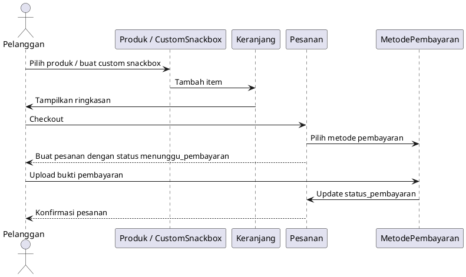
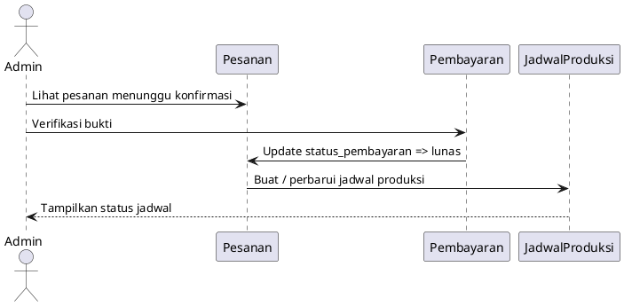
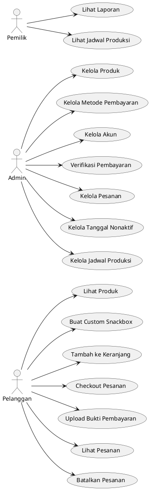
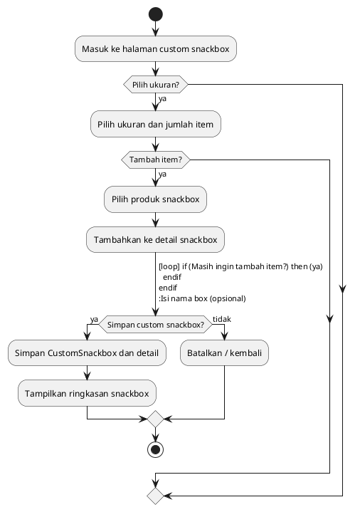
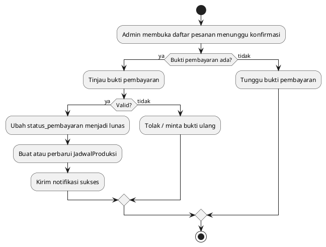

# Dokumentasi Perancangan Sistem (UML)

## 1. Tujuan
Dokumentasi ini menjelaskan perancangan sistem aplikasi pemesanan snackbox, produk, dan manajemen pesanan menggunakan format UML. Fokusnya pada struktur domain, hubungan antar entitas, dan alur proses utama.

## 2. Aktor Utama
- Pelanggan
- Admin
- Pemilik

## 3. Use Case Utama
1. Pelanggan:
   - Lihat produk
   - Buat custom snackbox
   - Tambah produk ke keranjang
   - Checkout pesanan
   - Upload bukti pembayaran
   - Lihat dan batalkan pesanan

2. Admin:
   - Kelola produk
   - Kelola metode pembayaran
   - Kelola akun
   - Verifikasi pembayaran
   - Kelola pesanan
   - Kelola tanggal nonaktif
   - Kelola jadwal produksi

3. Pemilik:
   - Melihat laporan penjualan
   - Melihat jadwal produksi

## 4. Class Diagram (Model Domain)
Berikut adalah diagram kelas UML dalam format PlantUML. Diagram ini menggambarkan entitas utama dan relasinya.

### 4.1 Penjelasan Relasi
- `User` memiliki banyak `KeranjangDetail`, `CustomSnackbox`, dan `Pesanan`.
- `Produk` dikategorikan oleh `KategoriProduk` dan bisa muncul dalam keranjang, custom snackbox, dan detail pesanan.
- `Pesanan` menggunakan `MetodePembayaran`, memiliki banyak `DetailPesanan`, dan dapat dijadwalkan di `JadwalProduksi`.
- `CustomSnackbox` memuat banyak `CustomSnackboxDetail` dan dapat ditempatkan di `KeranjangDetail` atau `DetailPesanan`.

## 5. Sequence Diagram: Proses Checkout Pelanggan

## 6. Sequence Diagram: Proses Admin Verifikasi dan Jadwal Produksi

## 6.1 Use Case Diagram: Aktor dan Use Case Utama

## 7. Alur Sistem Lengkap

### 7.1 Autentikasi dan Akses Role-Based
1. Pengguna mengakses halaman login atau registrasi.
2. Setelah login, sistem memeriksa `role` pengguna.
3. Jika `pelanggan`, diarahkan ke `pelanggan.dashboard`.
4. Jika `admin`, diarahkan ke `admin.dashboard`.
5. Jika `pemilik`, diarahkan ke `pemilik.dashboard`.
6. Semua route khusus role dilindungi oleh middleware `auth` dan `role:<role>`.

### 7.2 Alur Pelanggan
1. Pelanggan melihat daftar produk yang tersedia dan dapat memfilter berdasarkan kategori.
2. Pelanggan memilih produk biasa atau membuat custom snackbox.
3. Untuk custom snackbox:
   - Pelanggan memilih ukuran, jumlah item, dan nama box.
   - Sistem menyimpan `CustomSnackbox` dan detail snackbox (`CustomSnackboxDetail`).
   - Pelanggan dapat mengedit atau menghapus custom snackbox sebelum checkout.
4. Pelanggan menambahkan produk atau custom snackbox ke keranjang (`KeranjangDetail`).
5. Pelanggan dapat memperbarui jumlah, menghapus item, atau mengosongkan keranjang.
6. Saat checkout, sistem membuat `Pesanan` baru, menghitung `total_harga`, dan menempatkan item keranjang ke `DetailPesanan`.
7. Pesanan awal memiliki status `menunggu_pembayaran` dan `status_pembayaran` `belum_bayar`.
8. Pelanggan memilih `MetodePembayaran` aktif dan mengunggah bukti pembayaran.
9. Setelah bukti diunggah, status pembayaran berubah menjadi `menunggu_konfirmasi`.
10. Pelanggan dapat melihat detail pesanan, status pembayaran, dan membatalkan pesanan bila memenuhi aturan.

### 7.3 Alur Admin
1. Admin masuk ke dashboard admin.
2. Admin mengelola data produk: membuat, membaca, memperbarui, menghapus.
3. Admin mengelola metode pembayaran, termasuk menonaktifkan atau mengaktifkan metode.
4. Admin mengelola akun pengguna (admin, pelanggan, pemilik), termasuk reset password.
5. Admin mengatur tanggal nonaktif di mana pemesanan tidak bisa dipilih.
6. Admin meninjau pesanan yang menunggu konfirmasi pembayaran.
7. Admin memverifikasi bukti pembayaran dan memperbarui `Pesanan` menjadi `lunas` jika valid.
8. Setelah verifikasi, admin membuat atau memperbarui entri `JadwalProduksi` untuk pesanan tersebut.
9. Admin dapat memonitor status produksi pesanan `menunggu`, `produksi`, `selesai`.

### 7.4 Alur Pemilik
1. Pemilik melihat ringkasan laporan penjualan berdasarkan rentang tanggal atau kategori.
2. Pemilik meninjau jadwal produksi untuk melihat jumlah pesanan dan status produksi.
3. Pemilik dapat menggunakan informasi ini untuk keputusan operasional dan stok.

## 7.5 Activity Diagram: Proses Custom Snackbox Pelanggan

## 7.6 Activity Diagram: Proses Verifikasi Pembayaran Admin

## 8. Komponen Sistem dan Alur Utama
1. Frontend menampilkan daftar produk, detail produk, custom snackbox, keranjang, dan halaman pesanan.
2. Backend Laravel menangani route role-based untuk `pelanggan`, `admin`, dan `pemilik`.
3. Model Eloquent mencerminkan entitas dan aturan relasi database.
4. Process flow penambahan ke keranjang -> checkout -> pembayaran -> konfirmasi -> produksi.

## 9. Rekomendasi Dokumentasi Lanjutan
- Tambahkan class diagram controller jika ingin memperlihatkan alur logika aplikasi.
- Tambahkan activity diagram untuk proses pembuatan custom snackbox dan pengelolaan tanggal nonaktif.
- Buat use case diagram terpisah jika perlu presentasi ke stakeholder.
